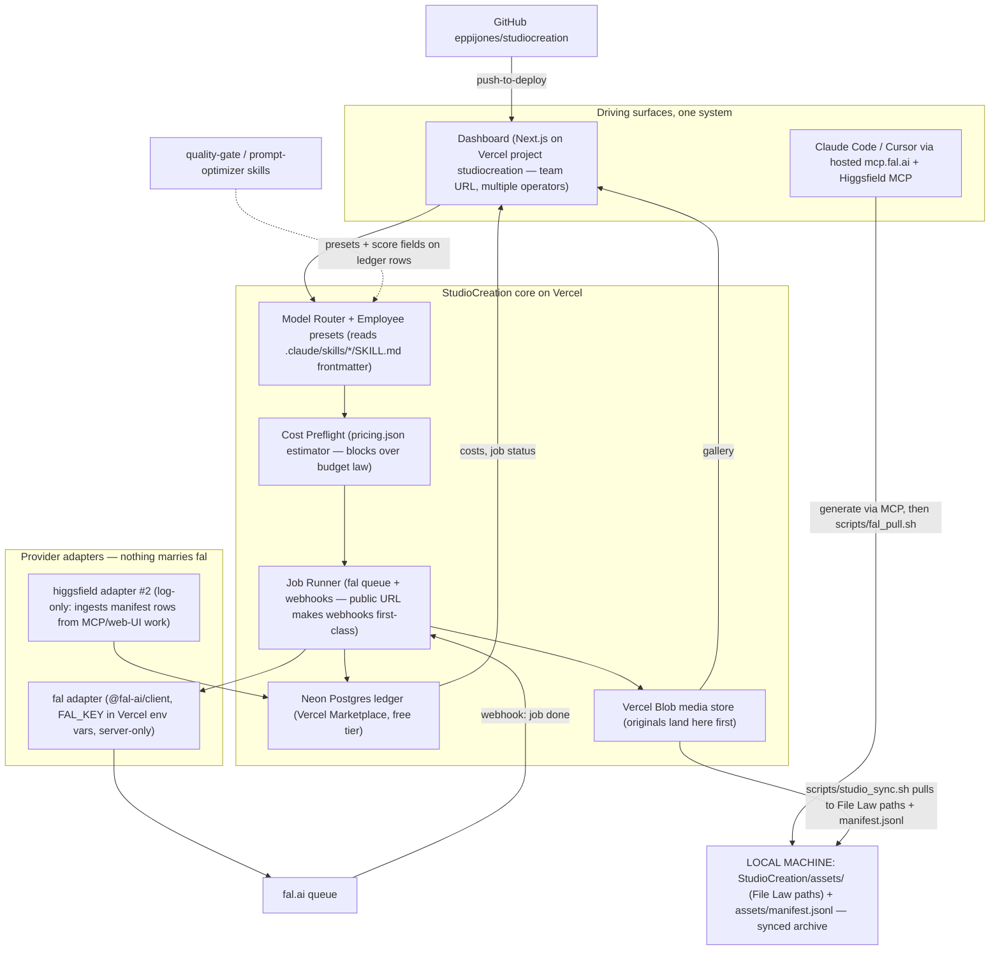

# StudioCreation — Foundation MVP Plan

> **STATUS NOTE (2026-06-14):** Original pre-build plan, kept for history.
> `CLAUDE.md` and `README.md` are authoritative for current behavior. Since
> superseded: the **Higgsfield-hybrid / hosted-MCP bridge** (incl.
> `scripts/hf_pull.sh` and the `/handoff` page) was dropped for a **fal-only**
> studio in dollars; and the **daily $7.50 cap** below became a **weekly $50
> shared cap + monthly $120 team pool** (see `config/budget.json`). The FinOps
> dissent recorded below effectively won.

War-room convened: 10 leads + 5 advisors. Converged on one plan.
**DISSENT — FinOps lead:** go all-fal immediately; hybrid's manual web-UI drafting hides a labor cost the ledger never sees. Overruled 14–1 until Jul 4.

---

## 0. HOME & WIRING (locked)

- **Repo:** `/Users/espenhorne/DEV/espenhorne/StudioCreation` — standalone, app at repo root. Nothing is built inside the STARXI workspace.
- **GitHub:** `https://github.com/eppijones/studiocreation` (remote `origin` from the first commit). ⚠️ Repo is currently PUBLIC — recommend flipping to private before briefs/brand material land; secrets stay out of git either way.
- **Vercel:** project `studiocreation` (`prj_1vzi4muIk8rvyWfXxGhDS3pDKbw7`) under the "StrikeLab's projects" scope (Hobby). Session 1 connects the project to the GitHub repo → every push to `main` auto-deploys; PRs get preview URLs.
- **Seeded from `STARXI/higgsfield-studio` (copy, then independent):** `.claude/skills/*` (the 9 employees), `CLAUDE.md`/`AGENTS.md` house rules (brand sections genericized to "brand profiles"), `scripts/hf_pull.sh`, `assets/manifest.jsonl` File Law.
- **Secrets:** `FAL_KEY` copied into `StudioCreation/.env` (gitignored, never printed — `grep '^FAL_KEY=' | >>`, no echo) and set as a server-only Vercel env var. Never in client bundles, logs, or commits.

## 1. ARCHITECTURE ONE-PAGER

Next.js + TS app **deployed on Vercel** so the whole team operates it from one URL. Media and ledger live in the cloud (Vercel Blob + Neon Postgres); a sync script mirrors everything down to the local machine under File Law, so local `assets/` remains the permanent archive.



**Key decisions:**
- **Vercel hosting unlocks webhooks (Backend lead):** with a public URL, fal's queue webhooks become the primary completion signal — no polling loop, no long-running process, fits serverless perfectly. Polling stays as fallback behind the adapter interface.
- **Storage split:** Vercel Blob holds originals (cloud gallery is instant for everyone); Neon Postgres (free tier, via Vercel Marketplace) is the queryable ledger — SQLite can't persist on serverless.
- **Local files still win:** `scripts/studio_sync.sh` pulls new Blob assets down to `assets/<project>/<YYYY-MM-DD>/<HHMMSS>_<model>_<label>.<ext>` and appends `assets/manifest.jsonl`. The machine remains the permanent, Finder-browsable archive; the cloud is the working surface.
- **Team access on Hobby (Security lead):** Vercel Password Protection is a Pro feature and Vercel Authentication only covers team members (Hobby = solo). MVP ships a ~20-line shared-password middleware (`STUDIO_PASSWORD` env var, signed cookie) — works for multiple employees at $0. Real per-user auth (Clerk) is explicitly deferred; the ledger logs an operator name from a simple picker.
- **Two ledgers, one truth:** `assets/manifest.jsonl` stays the append-only File-Law log; Postgres is the queryable index. MCP-driven jobs enter via manifest import; app jobs sync down to the manifest.
- **Employees = the 9 seeded skills.** The app parses frontmatter (name/description) + a new optional `studio:` block (default model, style string, ratio) added to each SKILL.md. No duplicate registry. Brand styling comes from editable "brand profile" presets, not hard-coded brands.
- **MCP convergence:** `scripts/fal_pull.sh` (clone of `hf_pull.sh`) lets Claude Code/Cursor log MCP-driven fal generations into the same manifest → app imports them.
- **Budget law ported to dollars** (at ~$0.05/cr equivalence): preflight always; >$1.25/job needs explicit confirm click; daily soft cap $7.50 (shared across all operators) with 75% warning banner. fal balance ≈ $70 = finite.
- **Infra cost:** Vercel Hobby $0 + Neon free tier + Blob ~cents/GB — effectively $0 added.

## 2. MVP SCOPE CUT

**IN:** Vercel-hosted dashboard (one team URL, shared-password gate) · GitHub push-to-deploy · generate panel with employee picker + operator-name picker · model router (pricing.json-driven) · job queue with live status (fal webhooks) · cloud asset gallery (Blob, images + video) · local sync script (Blob → File Law folders + manifest.jsonl) · cost ledger (Postgres) + shared daily-cap banner · cost preflight gate · manifest import (MCP/Higgsfield jobs) · `scripts/fal_pull.sh`.

**OUT:** real per-user auth (Clerk etc. — shared password only) · sharing/publish · editing suite (ffmpeg recipes stay manual/skill-driven) · mobile · roles/permissions · LLM-in-the-loop prompt optimization (Claude/Cursor already do this) · Soul/LoRA training · batch-brief runner (session 7 stretch only).

## 3. BUILD ORDER — 6 sessions, each a runnable increment

1. **Bootstrap + first light:** init the repo at `/Users/espenhorne/DEV/espenhorne/StudioCreation`, add `origin` → `eppijones/studiocreation`, seed skills/scripts/house-rules from `higgsfield-studio`, copy `FAL_KEY` into `.env` (gitignored), scaffold Next.js + TS + `@fal-ai/client`, `config/pricing.json` v1, fal adapter with one cheap image model (FLUX-schnell class, ~$0.003–0.02). Link the Vercel project (`vercel link` → `studiocreation`), set `FAL_KEY` env var, connect the GitHub repo for push-to-deploy, push — **ends with a real fal generation visible on the LIVE Vercel deployment.** Spend ceiling: <$0.25.
2. **Queue + ledger:** provision Neon Postgres + Vercel Blob via Marketplace, schema (jobs, assets, spend, operator), fal webhook endpoint as completion signal (polling fallback), live status UI, cost preflight gate wired to pricing.json, shared daily-cap banner, shared-password middleware on.
3. **Employees + router:** parse `.claude/skills/*/SKILL.md`, add `studio:` frontmatter blocks, employee picker + operator picker prefill model/ratio/style-string, full generate form (image + video models), brand-profile presets.
4. **Gallery + sync:** Blob-backed gallery with video playback and quality-gate score field (0–10) on ledger rows; `scripts/studio_sync.sh` mirrors Blob → local `assets/` File Law folders + appends `manifest.jsonl`.
5. **Cost dashboard + reconciler:** spend by day/project/model/operator, reconcile Postgres vs fal Platform API request history (`api.fal.ai/v1/models/pricing` + usage endpoints), flag drift.
6. **Adapter #2 + MCP bridge:** `scripts/fal_pull.sh`, manifest import endpoint, Higgsfield rows (credits → $ at pack rate) appear in the same ledger; paste-ready-package generator for web-UI-only Higgsfield features.
7. *(Stretch)* Batch-brief runner: a `briefs/*.md` shot table → queued draft batch.

## 4. COST MODEL + CALCULATOR SPEC

**`config/pricing.json`** (editable, the router's single source of truth):

```json
{ "providers": { "fal": { "models": {
  "fal-ai/flux/schnell":   { "unit": "image", "usd": 0.02 },
  "fal-ai/nano-banana-2":  { "unit": "image", "usd": 0.08, "tiers": {"4k": 0.16} },
  "fal-ai/nano-banana-pro":{ "unit": "image", "usd": 0.15, "tiers": {"4k": 0.30} },
  "fal-ai/wan-2.5":        { "unit": "video_second", "usd": 0.05 },
  "fal-ai/kling-2.5-turbo-pro": { "unit": "video_second", "usd": 0.07 },
  "fal-ai/kling-3.0-pro":  { "unit": "video_second", "usd": 0.112, "audio_on": 0.168 },
  "fal-ai/seedance-2.0":   { "unit": "video_second", "usd": 0.3034, "fast": 0.2419 },
  "fal-ai/veo-3.1-fast":   { "unit": "video_second", "usd": 0.10, "audio_on": 0.15 }
}},
  "higgsfield": { "usd_per_credit_by_pack": {"26": 0.052, "49": 0.049, "95": 0.0475, "190": 0.0475} } } }
```

- **Preflight estimator:** `estimate(jobSpec) → {usd, breakdown}` = unit price × count/duration × resolution/audio multipliers; rendered in the generate panel BEFORE submit; submit disabled if > remaining daily cap, confirm-modal if > $1.25.
- **Reconciler:** nightly/manual job pulls fal request history via Platform API, matches request_ids to ledger rows, flags estimate-vs-actual drift > 10% and prompts a pricing.json update.

**Three monthly scenarios** (image avg $0.035 = 75% draft-class @$0.02 + 25% NB2 @$0.08 · draft clip = 5s @ ~$0.30 blended Wan/Kling2.5T · hero clip = 5s @ ~$1.25 blended Kling3.0-audio $0.84 / Seedance2.0 $1.52 · Higgsfield credits per Day-0 calibration: image ~0.8cr, draft 4.8cr, hero ~15cr):

- **LIGHT (100 img + 20 drafts + 5 heroes)**
  - (a) all-fal: $3.50 + $6.00 + $6.25 = **$15.75**
  - (b) HF credits: 80+96+75 = 251 cr → $26/500 pack = **$26**
  - (c) hybrid: HF web-UI unlimited drafts $0 + 5 fal heroes $6.25 + ~25 text-critical fal images $2 = **~$8**
  - **Winner: HYBRID ($8); all-fal ($16) after Jul 4.**
- **STANDARD (500 img + 100 drafts + 20 heroes)**
  - (a) all-fal: $17.50 + $30 + $25 = **$72.50**
  - (b) HF credits: 400+480+300 = 1,180 cr → $49+$26 packs = **$75**
  - (c) hybrid: $25 heroes + ~$8 fal images = **~$33**
  - **Winner: HYBRID ($33); after Jul 4 all-fal edges HF ($73 vs $75) and carries no LLM-turn tax or badge ambiguity.**
- **HEAVY (2,000 img + 500 drafts + 60 heroes)**
  - (a) all-fal: $70 + $150 + $75 = **$295**
  - (b) HF credits: 1,600+2,400+900 = 4,900 cr → $190+$49 (5,000 cr) = **$239**
  - (c) hybrid: $75 heroes + ~$32 fal images = **~$107** — but 500 manual web-UI drafts will hit fair-use throttling and real labor hours
  - **Winner: HYBRID until Jul 4 (if throttling holds); after Jul 4, HF credits are sticker-cheapest ($239) but all-fal ($295) wins risk-adjusted — full automation, no fair-use cliff, no surprise LLM line items. HEAVY exceeds the $70 fal balance either way: top-up decision required before any HEAVY month.**

fal balance check: $70 covers ~4 LIGHT or ~1 STANDARD all-fal month. The app's cap banner enforces this.

## 5. DECISION MEMO — full fal pivot vs hybrid-until-Jul-4

- Systems Architect: hybrid — adapter pattern makes the pivot a config change, take the free drafts.
- Backend: hybrid — fal adapter gets built either way; nothing is wasted.
- Frontend: hybrid — dashboard is provider-agnostic, no UI cost.
- AI/ML Pipeline: hybrid — consistency stack (ref sheets → ref-to-video) works on both; keep both catalogs.
- MCP & Integrations: hybrid — both MCPs are hosted, zero maintenance for us.
- Data: hybrid — dual-source ledger is MORE data for the August decision.
- DevOps: hybrid — but fal-only for anything automated; web-UI drafts stay manual.
- Security: hybrid — FAL_KEY stays server-side, never in client bundles; fine either way.
- QA: hybrid — quality-gate is provider-neutral by design.
- FinOps: **all-fal now (DISSENT, recorded above)** — hybrid hides labor cost.
- Entertainment-media exec: hybrid — never abandon a prepaid asset 24 days early.
- Short-form strategist: hybrid — draft volume is the content engine; free volume wins.
- Film director: hybrid — heroes on fal's Seedance/Kling 3.0/Veo regardless.
- Art director: hybrid — but route ALL text/ref-sheet work to fal NB-Pro/NB2 now (HF passes for those already lapsed Jun 11).
- Creative-agency ECD: hybrid — ship the system, switch backends on a date, not a vibe.

**Majority 14–1: HYBRID until Jul 4, then full fal pivot by default.**

**Kill-criteria that flip to full-fal early:** (1) HF web-UI unlimited badge stops applying or fair-use throttles below ~20 drafts/day; (2) HF web Supercomputer LLM-credit drain exceeds 50 cr/week of passive loss; (3) a needed model exists only on fal (e.g. day-one drop); (4) Jul 4 arrives. **Flip back to HF-credits only if:** fal sticker prices rise >25% or fal reliability (failed/billed jobs) exceeds 5%.

## 6. TOP 5 RISKS

1. **Fair-use loss on HF unlimited** → all heroes and text-critical images already routed to fal; losing drafts costs ≤ $0.30/clip, not a workflow.
2. **fal spend creep** → hard preflight gate, $1.25 confirm threshold, $7.50/day shared soft cap, weekly reconciler vs fal request history.
3. **Scope creep** → the OUT list is law; any new feature request becomes a `briefs/` note for August, not code.
4. **Model churn** → pricing.json + adapter interface = one JSON row per new model; reconciler flags stale prices automatically.
5. **Single-maintainer burnout** → every session ends runnable and deployed via push-to-deploy; managed infra only (Vercel/Neon/Blob — nothing to operate); if work stops at session 2 the team still has a working online generator + ledger.

---

AWAITING GO — reply 'build session 1' to start.
